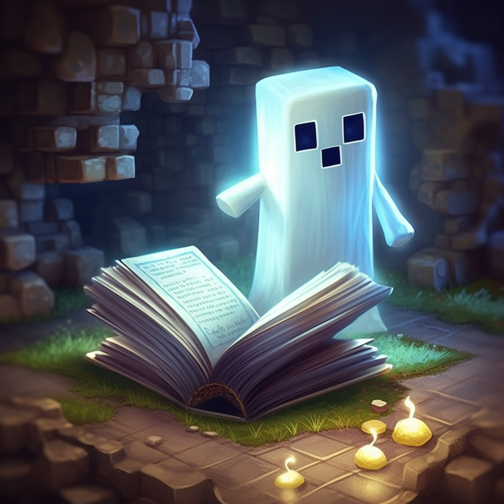
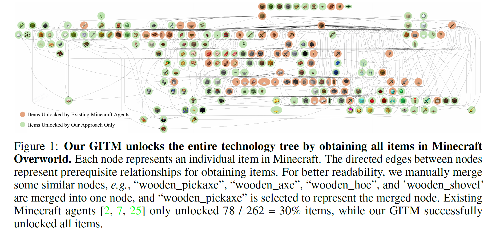
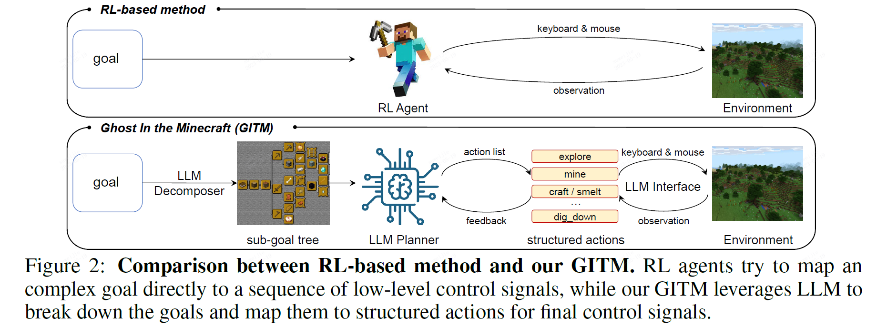
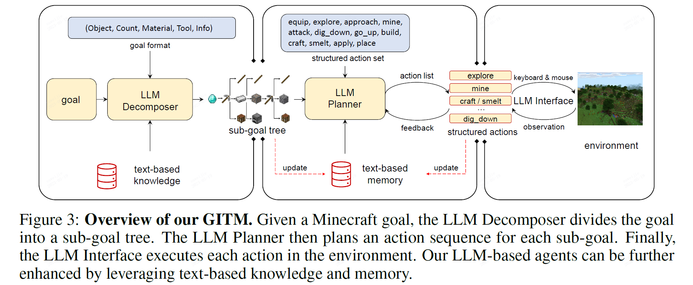
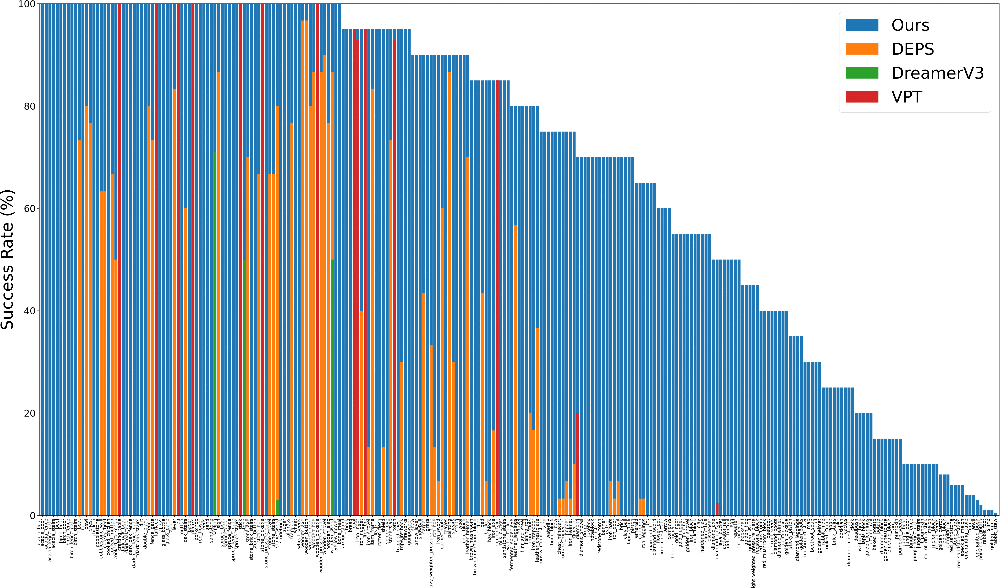
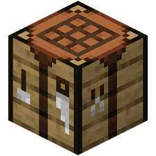
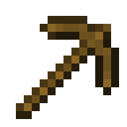
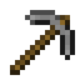
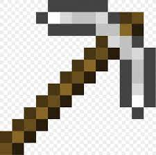
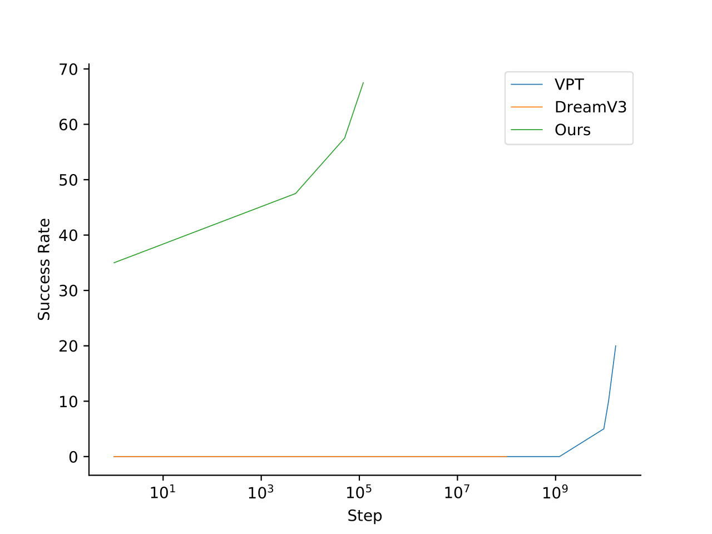

<div align="center">
 <h1> Ghost-in-the-Minecraft </h1>
 
 

[[Preprint Paper]](https://github.com/OpenGVLab/GITM/blob/main/GITM.pdf)

</div>

Minecraft, as the world's best-selling game, boasts over 238 million copies sold and more than 140 million peak monthly active users. Within the game, hundreds of millions of players have experienced a digital second life by surviving, exploring and creating, closely resembling the human world in many aspects. Minecraft acts as a microcosm of the real world. Developing an automated agent that can master all technical challenges in Minecraft is akin to creating an artificial intelligence capable of autonomously learning and mastering the entire real-world technology.

**Ghost in the Minecraft (GITM)** is a novel framework integrates Large Language Models (LLMs) with text-based knowledge and memory, aiming to create Generally Capable Agents in Minecraft. GITM features the following characteristics:

- **Broad task coverage.** All previous agents combined can only achieve 30% completion rate of all items in the Minecraft Overworld technology tree, while GITM is able to unlock 100% of them.

- **High success rate.** GITM achieves 67.5% success rate on the "ObtainDiamond" task, improving the SOTA (OpenAI's VPT) by +47.5%.

- **Excellent training efficiency.** OpenAI's VPT needs to be trained for 6,480 GPU days, DeepMind's DreamerV3 needs to be trained for 17 GPU days, while our GITM does not need any GPUs and can be trained in 2 days using only a single CPU node with 32 CPU cores.

This research shows the potential of LLMs in developing capable agents for handling long-horizon, complex tasks and adapting to uncertainties in open-world environments.

<div align="center">
 
 
 
 GITM can handle various biomes, environments, day and night scenes, and even encounter monsters with ease.

 
</div>

# 🤖 Demo Video

**Obtain Enchanted Book** 

https://github.com/OpenGVLab/GITM/assets/39956983/a3fb6ca7-aed5-4e16-821d-0b0284704ffd

The enchanted book is the ultimate creation in the technology tree of Minecraft Overworld. 

Watch high-definition video on [YouTube](https://youtu.be/qDdd3qp41zo).

**Obtain Diamond**

https://github.com/OpenGVLab/GITM/assets/39956983/40b43d92-7113-4497-a577-acb81603bf4e

Watch high-definition video on [YouTube](https://youtu.be/r0NRjLsOXvw).

# 🏠 Overview

The biggest dilemma of previous RL-based agents is how to map an extremely long-horizon and complex goal to a sequence of lowest-level keyboard/mouse operations. To address this challenge, we propose our framework Ghost In the Minecraft (GITM), which uses Large Language Model (LLM)-based agents as a new paradigm. Instead of direct mapping like RL agents, our LLM-based agents employ a hierarchical approach. It first breaks down the decompose goal into sub-goals, then into structured actions, and finally into keyboard/mouse operations.

<div align="center">

 </div>

The proposed LLM-based agent consists of a LLM Decomposer, a LLM Planner, and a LLM Interface, which are responsible for the decomposition of sub-goals, structured actions, and keyboard/mouse operations, respectively.

- **LLM Decomposer** first decomposes a goal in Minecraft into a series of well-defined sub-goals according to the text-based knowledge collected from the Internet.

- **LLM Planner** then plans a sequence of structured actions for each sub-goal. LLM Planner also records and summarizes successful action lists into a text-based memory to enhance future planning.

- **LLM Interface** execute the structured actions to interact with the environment by processing raw keyboard/mouse input and receiving raw observations.

<div align="center">

 </div>


# 🎫 Results

### Success Rate for the Entire Technology Tree

<div align="center">

 </div>

GITM achieves non-zero success rates for all items which indicates a strong collecting capability, while all previous methods combined can only complete 30% of these items.

### Success Rate for the ObtainDiamond Challenge

| Methods | Crafting Table  | Wooden Pickaxe  | Stone Pickaxe  | Iron Pickaxe  | Diamond  |
| --- | --- | --- | --- | --- | --- |
| DreamerV3 | - | 50.0 | 3.0 | 0.01 | 0.01 |
| DEPS | 90.0 | 80.0 | 73.3 | 10.0 | 0.6 |
| VPT | 100.0 | 100.0 | 100.0 | 85.0 | 20.0 |
| Our GITM | 100.0 | 100.0 | 100.0 | 95.0 | 67.5 |

### Learning Efficiency

<div align="center">

 </div>

GITM only requires a single CPU node with 32 cores for training. Compared with 6,480 GPU days of OpenAI's VPT and 17 GPU days of DeepMind's DreamerV3, GITM improves the efficiency by at least 10,000 times.


# 🖊️ Citation

If you find this project useful in your research, please consider cite:

```
@article{zhu2023ghost,
  title={Ghost in the Minecraft: Generally Capable Agents for Open-World Enviroments via Large Language Models with Text-based Knowledge and Memory},
  author={Zhu, Xizhou and Chen, Yuntao and Tian, Hao and Tao, Chenxin and Su, Weijie and Yang, Chenyu and Huang, Gao and Li, Bin and Lu, Lewei and Wang, Xiaogang and Qiao, Yu and Zhang, Zhaoxiang and Dai, Jifeng},
  year={2023}
  journal={hal-04107105, version 1},
}
```
